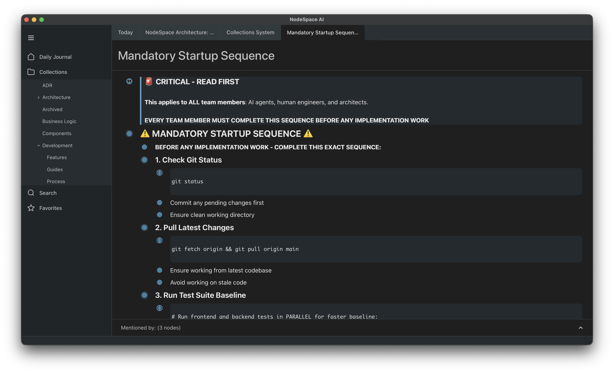

# NodeSpace

> **Your repo knows what you built. NodeSpace knows why.**

The workspace for agentic development. Specs, plans, decisions and your team's conventions live in one local graph, and every coding agent works from it: what to build, what governs it, and how your team does it.

**[nodespace.ai](https://nodespace.ai)** · **[Download](https://github.com/NodeSpaceAI/nodespace-core/releases)** · **[Discord](https://discord.gg/UHFZKzH9)**

> ⚠️ **Alpha Preview** — NodeSpace is in early development. Features may change and data formats are not yet stable.



---

## The context ladder

How good an agent is depends on the context it starts with. Every team climbs the same ladder, and most stop at step three.

1. **Prompting.** Copy, paste and re-explain every session. The context lives in your head.
2. **Connecting.** MCP into Jira, Linear or Notion. The context lives in tools built for people, and the agent has to know what to search for.
3. **Documenting.** Specs, decisions and conventions live as markdown in the repo, starting with CLAUDE.md. The agent greps for them, and they are only as current as each checkout's last pull. Following them is optional.
4. **Assembling.** Each task starts with the right context already composed: its spec, the decisions behind it, and the conventions that apply. One source, current for everyone, and the process is enforced, not suggested.

NodeSpace takes you to step four, without building it yourself.

---

## What NodeSpace does

- **A local knowledge graph with semantic search.** Typed nodes, links between them, and search that understands what an agent is asking for. It runs on your machine and works offline.
- **Skills for coding agents.** Agents fetch skills and schemas for the task at hand through the CLI (`nodespace skill guidance`, `nodespace skill get`). The skill installer sets this up for Claude Code, Codex, Antigravity CLI, OpenCode and Pi. MCP covers surfaces with no shell.
- **Plays.** A play is a set of rules. Each rule has a trigger (an event in the graph), conditions it checks, and actions that update the graph: change a node, create and link nodes, or reject a write. Plays are data, so you edit them rather than fork anything. View them in the app and switch them on and off.
- **Saved queries and boards.** Kanban, lists and tables over any query.
- **A desktop app.** Where you review, edit and organize what agents use. Agents and people work on the same graph.

## Local-first

Your knowledge stays on your hardware and works offline. NodeSpace is a standalone desktop app: nothing to host, no Docker, no database to set up. Search and embeddings run inside the app, with no per-query cloud bill, so agents can check context throughout a task.

## Installation

### macOS (Apple Silicon) — Homebrew

```bash
brew install --cask nodespaceai/nodespace/nodespace
```

Apple Silicon is the only supported macOS target. The cask installs a signed and notarized build — no Gatekeeper prompt to work around.

### Other platforms — manual download

**[Download NodeSpace →](https://github.com/NodeSpaceAI/nodespace-core/releases)**

| Platform | Format |
|----------|--------|
| Windows | `.msi` or `.exe` |
| Linux | `nodespace`/`nodespaced` binaries (CLI + daemon only — no packaged desktop app yet) |

### Get started

1. **Install the app** (above).
2. **Connect your coding agent.** On first launch the app detects the agents on your machine and installs the NodeSpace skill into each. To run the installer yourself, or on a machine with only the CLI:

   ```bash
   nodespace skill install    # detect agents and install the skill
   nodespace skill status     # see which agents have it
   ```

   For a harness the app did not launch, import the skill from [NodeSpaceAI/nodespace-skill](https://github.com/NodeSpaceAI/nodespace-skill). For surfaces with no shell, `nodespace mcp install` sets up MCP.
3. **Start a session.** Ask your agent for a task; it fetches your project's context and conventions from NodeSpace.

### Team synchronization

For team synchronization, contact [developer@nodespace.ai](mailto:developer@nodespace.ai).

### Build from Source

**Prerequisites:**
- [Bun 1.0+](https://bun.sh) — `curl -fsSL https://bun.sh/install | bash`
- [rustup](https://rustup.rs) — `curl --proto '=https' --tlsv1.2 -sSf https://sh.rustup.rs | sh`. It installs the Rust toolchain `rust-toolchain.toml` pins on the first build.

```bash
git clone https://github.com/NodeSpaceAI/nodespace-core
cd nodespace-core
bun install
bun run tauri:dev
```

---

## Running Tests

```bash
bun run test          # Fast unit tests (Happy-DOM)
bun run test:all      # Unit, scripts, skill and Rust tests
bun run rust:test     # Rust backend tests only
```

---

## Community

- 💬 [Join our Discord](https://discord.gg/UHFZKzH9) — ask questions, share feedback, follow development
- 🌟 [Star this repo](https://github.com/NodeSpaceAI/nodespace-core) if NodeSpace is useful to you
- 🐛 [Report a bug](https://github.com/NodeSpaceAI/nodespace-core/issues/new)

---

## License

NodeSpace is licensed under the [Functional Source License 1.1 (Apache 2.0)](https://fsl.software/).

- ✅ Use NodeSpace freely for any purpose
- ✅ Modify the code to fit your needs

See [LICENSE](LICENSE) for the full text.
